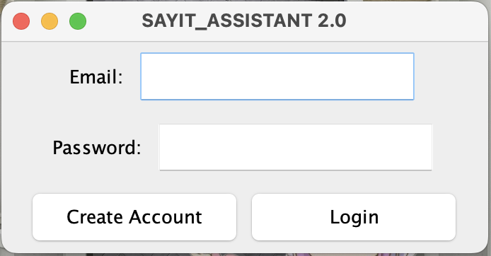

# SayIt Assistant

Hello! Welcome to SayIt Assistant 2 (SayIt2). Here’s how to set up the app. 

## Getting Started
It is assumed that you have the latest JDK installed. To begin, please do the following.

1. Create a `token.txt` file in the `app` directory. Paste your OpenAI token into this file and save.
2. Create a `mongo.txt` file in the `app` directory. Paste your MongoDB cluster connection string into this file and save.
3. Run `./gradlew run` from the project directory to start the application.

After doing so, SayIt2 should load up like this:

To create an account, enter your email and a password, and hit "Create Account," like so: 

A window should pop up asking you to verify your password. Type in your password and hit ok.

Finally, SayIt2 will ask you if you would like to save your login information. Choose as you like. After you've done so, SayIt2 should load up like this:

### Using the App
To give an input, click on the recording button and say the prompt out loud. Once you’re done, simply click the same button. After about 2-5 seconds, SayIt will display your prompt and answer on the main page. If you would like to copy the answer, simply highlight the portion of the answer and copy it.

The list of prompts are: "Question <question>," "Set up email," "Create an email to <recipient> about <email content>," "Send email to <recipient's email address>," "Delete prompt," and "Clear all." 

Don't remember all the prompts? No worries. Say anything and SayIt2 will give you hints on how you can start a prompt.

After an input, you might also notice that there is a new item on the side bar. Clicking on it will display the answer to the corresponding prompt. This might be useful when you have multiple prompts.

If you want to delete a prommpt, select the prompt by clicking on the prompt on the side bar, and say "Delete prompt" to SayIt2 as shown before.

If you want a fresh start, say "Clear all" to SayIt2 as shown before to delete all questions and answers.

### New Features
SayIt2 now allows its users to create and send emails. To do so, please first use the prompt "Set up email" to give the app all the necessary information. A window should appear like so:

Make sure to fill all fields in correctly, then click save. Your email setup is connected to your username, and you can access it on any device with your login. Now you can start creating and sending emails.

To create an email, say the prompt "Create an email" followed by a brief description of the recipient and the content. For example, "Create an email to Greg telling him our software product, SayIt2, is ready for demo tomorrow afternoon in the computer labs." SayIt2 will return a written email with a subject line and a signature of your choice.

To send the email, select an email from the side bar and say the prompt "Send email to" followed by the email address of the recipient. For example, "Send email to b jill at ucsd dot edu." SayIt2 will let you know whether the email was successfully sent on the main display. Note that you cannot send a prompt that isn't an email!

If you want to look at which emails you've sent or created, scroll through the side panel and you can see that emails created and sent are stored as prompts, and are synced across signed in devices.