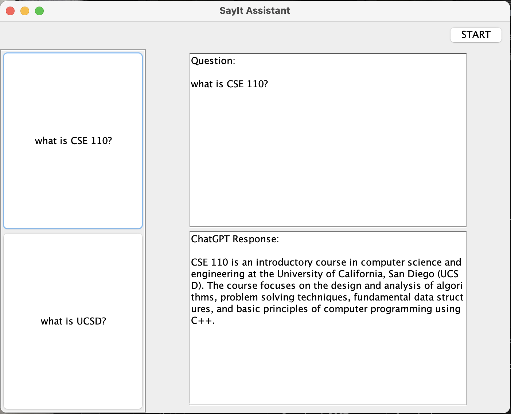
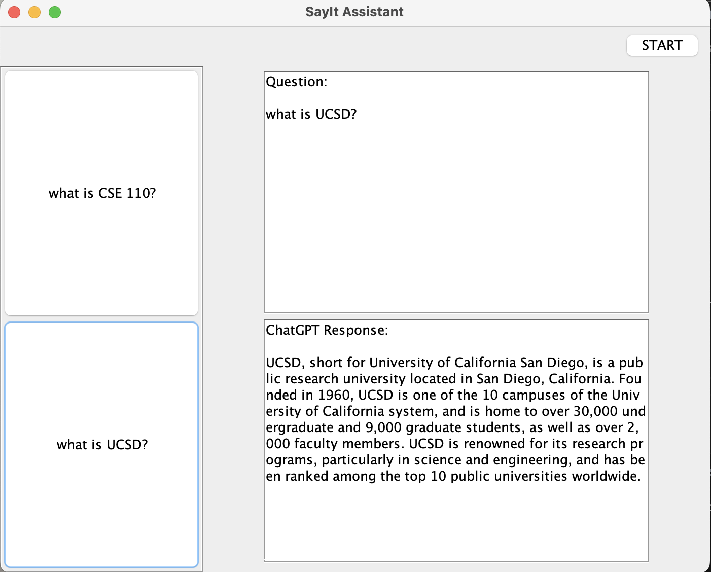

# SayIt Assistant

Hello! Welcome to SayIt Voice Assistant. Here’s how to set up the app. 

## Getting Started
It is assumed that you have the latest JDK installed. To begin, please do the following.

1. Create a `token.txt` file in the `app` directory. Paste your OpenAI token into this file and save.
2. Run `./gradlew run` from the project directory to start the application.

After doing so, SayIt Assistant should load up like this:

As you can see, there are several features on the interface. Here is what they’re for: 

### Using the App
To ask a question, click on the recording button and say the question out loud. Once you’re done, simply click the same button. After about 2 seconds, SayIt will display your question and answer on the main page. If you would like to copy the answer, simply highlight the portion of the answer and copy it.

You might also notice that there is a new item on the side bar. Clicking on it will display the answer to the corresponding question. This might be useful when you have multiple questions.

If you want to delete a question, select the question by clicking on the question on the side bar, and click the trashcan icon on the toolbar. Click on “OK” and the question will disappear on the screen and your records.

If you want a fresh start, click the “clear all” button to delete all questions and answers.

